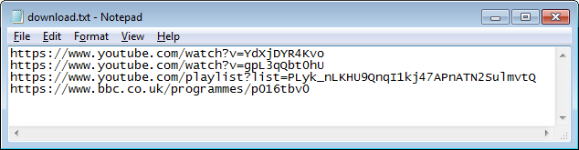

<!-- Global site tag (gtag.js) - Google Analytics -->

# youtube-dl-helper

youtube-dl-helper is a tool for Windows that can download video or audio from [many streaming sites](https://rg3.github.io/youtube-dl/supportedsites.html) without requiring you to use the command-line.

### If you have any problems or suggestions, send me an email: **mesdartin@gmail.com**

## How to use

* Download [youtube-dl-helper.zip](https://github.com/youtube-dl-helper/youtube-dl-helper.github.io/releases/download/v0.1/youtube-dl-helper.zip) and extract it anywhere on your computer that doesn't require administrator permission to write to (for example, the desktop or downloads folder are OK, but not the Program Files folder).

* Double-click on **download.txt** to open it in Notepad and paste in the URLs of the pages containing the video or audio you want to download. You can put multiple URLs on separate lines. Save the file with **Ctrl + S** or by clicking **File > Save**.

* Double-click on **run.bat**. A command-line window will open, showing the status of the downloading files. Once it has finished and the last line shows *"Press any key to continue"* you can close the window. The downloaded files will be in the **downloaded** folder.

## Downloading audio

* To download the audio of your URLs as MP3 files, open the **more** folder and run **mp3.bat** instead of **run.bat** (this will re-encode the audio to MP3 once it is downloaded).

* To download audio in the best quality available without re-encoding to MP3, run **audio.bat** in the **more** folder.

## Not working?

* If things stop working you may need to update youtube-dl, which you can do by running **update.bat** in the **more** folder.

## About this project

This tool is just a few very simple batch files that use [youtube-dl](http://rg3.github.io/youtube-dl/). The reason why you might want to use this instead of using youtube-dl directly is because youtube-dl by default...

* Requires the use of the command-line
* Can require additional software (FFmpeg, RTMPDump, Microsoft Visual C++ 2010 Redistributable Package)
* Names the files with the content ID appended to the title
* Saves videos from YouTube in various formats instead of only MP4

You may prefer to use [youtube-dl-gui](https://mrs0m30n3.github.io/youtube-dl-gui/).
